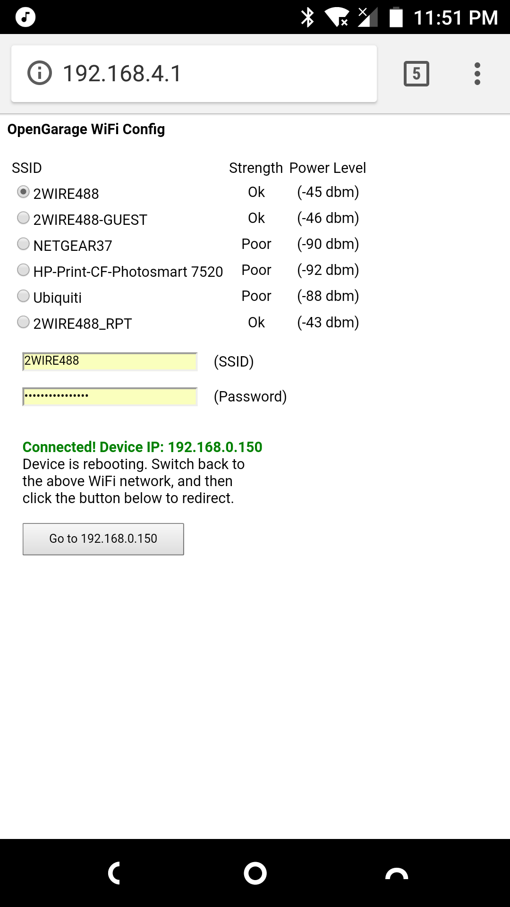
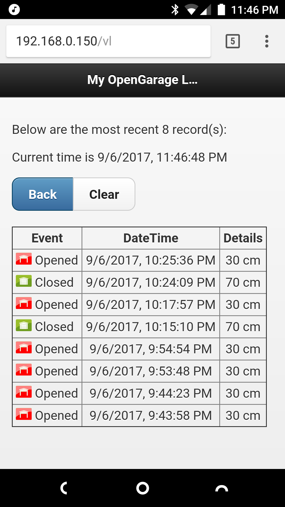
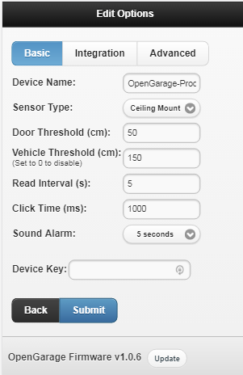
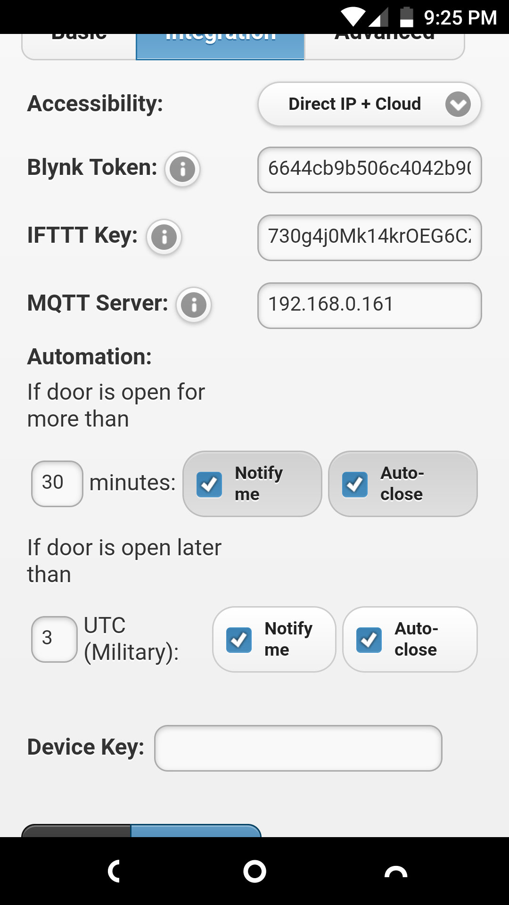

Fork of https://github.com/OpenGarage/OpenGarage-Firmware

Adds:
=======
* Support for magnetic or contact based door switch (Installed at bottom or top)
* Built in automation to close door at a certain time (No external service required)
* Built in MQTT support - allows adding workflow using things like NodeRed
* Some updates to main web page 
  * Change button text to reflect the specific action (open or close)
  * Add graphic to home page indicating door status
  * Close or Open state color coded
  * More detail on wireless signal strength
  * Status moved to top, wireless summary moved to front
* Log Page updates
  * Clear log button and related functions added
  * Ordering changed to match mobile app 
  * Graphic added to better match mobile app
* API Changes
  * Explicit close or open support added, unlike a click these are state aware (allows you to easily fire off a close activity 
  without worrying or first querying if the door is actually open and vice versa)
  * Ability to tell free heap
  * Ability to tell compile date/time 
  * Clear Logs function added
  * Reset all function added - for users without a reset button installed
* Debug improvements - Added tons of serial debug commands, if you get nothing else out of this verbose logging is now included
* Tons of little usability changes - Quick beeps on status changes as an example
 Check committ history for details

Issues Fixed:
=======
* WDT Resets if ultrasonic sensor not connected
* Save of SSID/Password failure in certain circumstances
* Time sync issues if code is delayed for any reason (mostly an issue with MQTT code)

Notes specific to this fork:
The mobile app doesn't know about some settings so can't display them (like magnetic sensor support). It doesn't seem to impact the app though.
If you want the graphics in the log and home page - you need to use the Arduino programming env (specifically the ESPFlash tool to upload them to the flash - at least until I figure out how to send them on the fly)

This folder contains the OpenGarage firmware code for Arduino with ESP8266.

For details, visit [http://opengarage.io](http://opengarage.io)

     

Updates:
=======
* (Mar 12) Release OG (OpenGarage) firmware 1.0.0

Requirement:
===========

* Arduino 1.6.5 (the firmware may NOT compile on newer Arduino versions)
* ESP8266 core for Arduino (https://github.com/esp8266/Arduino)
* Blynk library for Arduino (https://github.com/blynkkk/blynk-library)
* This (OpenGarage) library

Copy the OpenGarage library to your Arduino's libraries folder. You also need to update a file in the ESP8266 core and Blynk library. See README.txt in the Modifications folder for details.

Compilation:
===========

To compile, launch Arduino, select:

* File -> Examples -> OpenGarage -> mainArduino.
* Tools -> Board -> Generic ESP8266 Module (if this is not available, check if you've installed the ESP8266 core).
* Tools -> Flash Size -> 4M (1M SPIFFS).

Press Ctrl + R to compile. The compiled firmware (named mainArduino.cpp.bin) is by default copied to a temporary folder.

The firmware supports built-in web interface. The HTML data are embedded as program memory strings. Go to the html/ subfolder, which contains the original HTML files, and a gen_html.sh tool to convert these HTML files into program memory strings. If you make changes to the HTML files, re-run gen_html.sh to re-generate the program memory strings.

Uploading:
=========

As OpenGarage firmware supports OTA (over-the-air) update, you can upload the firmware through the web interface.

If you want to upload the firmware through USB, you should:

* Install CH340 driver:
  - Mac OSX: 
  - Linux: (dirver is not needed, make sure you run Arduino as root, or add 1a86:7523 to udev rules).
  - Windows: driver is only needed for Win 7 64-bit or Win XP ()

* In Arduino, select:
  - Upload Speed -> 230400 (this will improve the upload speed)
  - Port -> the correct serial port number

* Let OpenGarage enter bootloading mode:
  - Unplug the USB cable
  - Press and hold the pushbutton on OpenGarage while plugging in the USB cable
  - Release the pushbutton (the LED should stay on)
  
* In Arduino, press Ctrl + U to start uploading.

Firmware Features:
=================

The firmware supports a built-in web interface (which you can access using the device's local IP) as well as remote access using the Blynk app. 

* Install Blynk App:

It's recommended that you install the Blynk app, and scan the QR code (in the OGBlynkApp folder) before proceeding, in order to enable remote access right away. Once you have created the OG app, you can go to the project settings to copy the authorization token.

* Initial Connection to WiFi:

On first boot-up, the firmware starts in AP mode, creating a WiFi network named OG_XXXXXX where XXXXXX is the last six digits of the MAC address. This is an open AP with no password. The LED should blink quickly at about twice per second. Using your phone or computer to connect to this AP, then open a browser and type in

192.168.4.1

to access the AP homepage. Select (or manually type in) the desired SSID, password, and (optionally) Blynk's authorization token (refer to the instructions above). If you don't want to input the Blynk token, you can leave it empty for now. Then click 'Submit'. Wait for 20 to 30 seconds for the device to connect to your router. If successful, it will display the local IP address with further instructions.

* Reset to Factory Default:

At any time, you can press and hold the pushbutton for at least 5 seconds, until the LED stays solid on, then release the button. At this point, the device will perform factory reset and restart in AP mode.

* Using Blynk App:

Assuming you've input the Blynk auth. token during the set up, you can now open the Blynk app and it should show the device status, including distance sensor reading, door status, history, and the device's local IP and port number etc. You can also click the button to trigger a button press. The Blynk app is cloud-based, allowing you to remotely check and control your garage door opener.

* Using the Built-in Web Interface:

Open a browser and type in the device's local IP address, or you can try the device's MDNS name: OG_XXXXXX.local/ where XXXXXX is the last six digits of the MAC address. Note that MDNS service may not be available on all systems.

The build-in web interface allows you to:

  - Check the device status
  - Trigger button press
  - Configure options
  - View log
  - Reboot the device
  - Update firmware
  
Certain operations require a device key, which by default is

opendoor

In Options, you can change the device's accessibility, Blynk token, mount type, distance threshold, read interval, device name, HTTP port, and device key. Changing certain options (such as accessibility, token, HTTP port) requires a reboot.

* Determine the Distance Threshold

To determine the distance threshold, you should estimate the distance from OpenGarage sensor to the garage door when it's fully open (call this d1), and the distance to the top of the car when the car is parked in the garage (call this d2). Then set the threshold to be half way between d1 and d2. If you are not sure about d1 and d2, you can open the garage door, check the app or web interface for the distance reading (this is d1); then close the garage door, and check the distance again (this is d2). 

By default the mount type is 'ceiling mount'. This way, when the distance reading is less than the threshold, the door is regarded as open. If you have selected to use 'side mount', the logic will be reversed: when the distance reading is less than the threshold, it's assumed the door is closed.

Update Firmware:
===============

The current firmware version is displayed at the bottom of the homepage, as well as the Edit Options page. When a new firmware becomes available, you can click on the 'Update' button next to the firmware version to upload the new firmware.

If the update ever fails, power cycle (unplug power and plug back power) the device and try again. If it still doesn't work, you can update firmware through the USB port (see instructions above).

